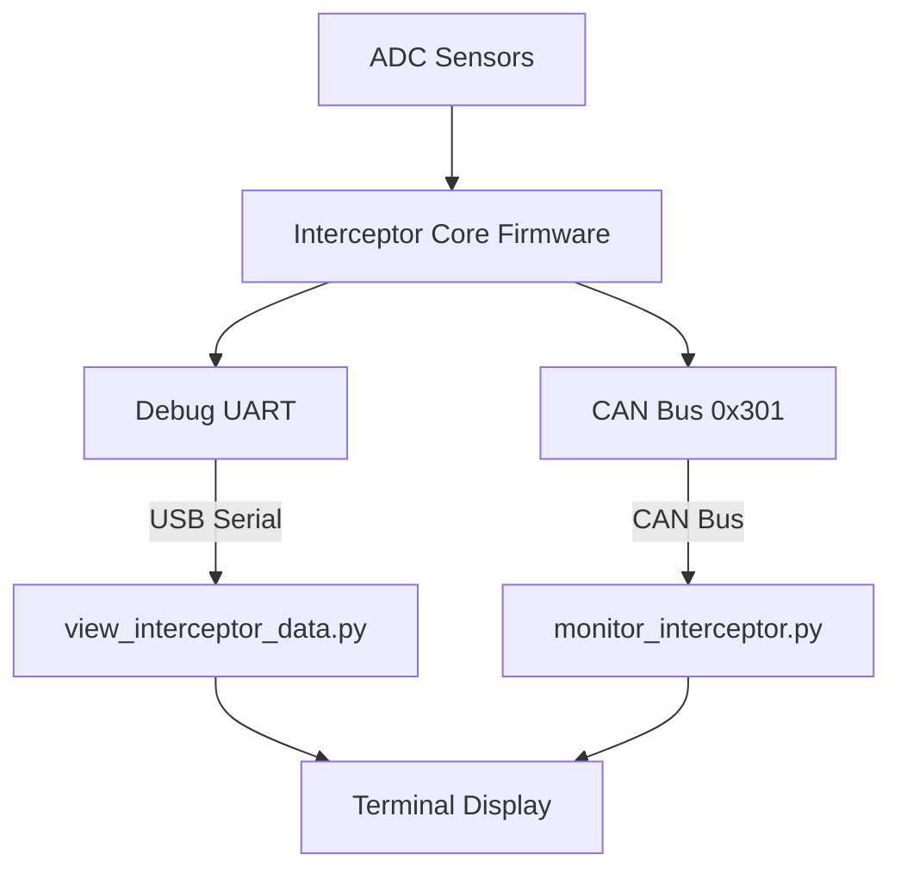

# Interceptor Core Monitoring & Debugging Tool

## Summary

Created comprehensive Python tools to verify Interceptor Core data output, with solutions for both CAN bus monitoring and direct debug serial access when CAN is unavailable.

## Primary Tool: Debug Serial Viewer ✅

### [view_interceptor_data.py](file:///home/d/retropilot/ocelot/view_interceptor_data.py) **← RECOMMENDED**

**Purpose**: Read Interceptor Core data directly from debug UART, bypassing CAN bus entirely.

**Why use this**:
- ✅ Works without physical CAN connection
- ✅ No USB conflicts (single process)
- ✅ Shows same data that would be sent on CAN
- ✅ Always works if USB is connected

**What it displays**:
- **Torque Input**: `|ADC0 - ADC1|` (differential magnitude)
- **Torque Output**: DAC0, DAC1 values
- **CAN Bus ID**: 0x301 (what would be sent on CAN)
- **System State**: Fault status
- **Relay Status**: Whether relay is active

**Usage**:
```bash
./view_interceptor_data.py
```

## Secondary Tools: CAN Bus Monitoring

### [monitor_interceptor.py](file:///home/d/retropilot/ocelot/monitor_interceptor.py)

CAN monitoring script for when physical CAN connection exists:
- Monitors CAN output on ID 0x301 (Differential) or 0x201 (Gas Pedal)
- Requires physical CAN bus between Interceptor Core and Chimera
- Displays real-time torque data from CAN messages

**Limitations**: Requires working CAN bus, prone to USB conflicts if multiple processes run.

### [test_interceptor.py](file:///home/d/retropilot/ocelot/test_interceptor.py)

Combined script that sends CAN input AND monitors output:
- Sends enable commands on CAN 0x300
- Monitors responses on CAN 0x301
- Avoids USB conflicts by using single process

### [send_test_input.py](file:///home/d/retropilot/ocelot/send_test_input.py)

Sends CAN control commands to activate Interceptor Core:
- Requires physical CAN connection
- Must run alongside monitor_interceptor.py

## Sensor Calibration Tool ✅

### [calibrate_sensors.py](file:///home/d/retropilot/ocelot/calibrate_sensors.py)

**Purpose**: Automatically calibrate ADC sensor validation ranges based on actual sensor readings.

**What it does**:
- Collects ADC samples from both sensors for 10 seconds
- Analyzes statistics (median, average, std deviation, range)
- Calculates optimal center points and tolerance values
- Provides exact configuration values for `stm_flash_config.py`

**Usage**:
```bash
./calibrate_sensors.py
```

**Calibration Results**: [CALIBRATION_RESULTS.md](file:///home/d/retropilot/ocelot/CALIBRATION_RESULTS.md)

**Example output**:
- ADC0: Center = 1538, Tolerance = ±125
- ADC1: Center = 1579, Tolerance = ±100

**Why calibrate**:
- Fixes `FAULT_ADC_UNCONFIGURED` or `UNKNOWN(11)` state
- Sets proper validation ranges based on actual sensor noise
- Prevents false sensor fault errors
- Allows Interceptor Core to operate normally

**After calibration**:
1. Apply values in `stm_flash_config.py`
2. Configure both ADC channels
3. Test with `./view_interceptor_data.py`
4. State should change to `NO_FAULT` ✅

## Override Threshold Tools

### [test_override_threshold.py](file:///home/d/retropilot/ocelot/test_override_threshold.py)

**Purpose**: Test override detection by monitoring torque magnitude in real-time.

**What it does**:
- Monitors torque magnitude continuously
- Shows percentage of threshold (color-coded)
- Alerts when override triggers
- Tracks maximum magnitude reached

**Usage**: `./test_override_threshold.py`

### [calibrate_override_threshold.py](file:///home/d/retropilot/ocelot/calibrate_override_threshold.py)

**Purpose**: Calibrate optimal override threshold based on actual use.

**What it does**:
- Collects data during normal operation
- Collects data during manual intervention
- Calculates optimal threshold (midpoint)
- Provides configuration values

**Usage**: `./calibrate_override_threshold.py`

**Note**: Override threshold = magnitude at which system detects manual intervention (default: 336)

## Torque Response Testing

### [test_torque_response.py](file:///home/d/retropilot/ocelot/test_torque_response.py)

**Purpose**: Send CAN commands and monitor DAC output changes in real-time.

**What it does**:
- Sends 6 different torque command scenarios
- Monitors DAC0 and DAC1 responses
- Analyzes if DAC responds correctly to commands
- Shows delta changes from initial values

**Test scenarios**:
1. Neutral (0, 0)
2. Positive torque (+100, -100)
3. Negative torque (-100, +100)
4. Large positive (+200, -200)
5. Large negative (-200, +200)
6. Return to neutral

**Usage**: `./test_torque_response.py`

**Expected behavior**: 
- Positive target_0 → DAC0 decreases, DAC1 increases
- Negative target_0 → DAC0 increases, DAC1 decreases
- Neutral → DAC returns to center (~2048)

## Automated Testing & Validation

### [test_suite.py](file:///home/d/retropilot/ocelot/test_suite.py)

**Purpose**: Automated test suite for comprehensive validation.

**Test categories**:
- **Unit Tests**: Device connection, ADC/DAC validation, state checks
- **Integration Tests**: Data consistency, continuous operation
- **Regression Tests**: ADC drift detection, calibration verification

**Usage**: `./test_suite.py`

**Tests included**:
1. Device connection
2. Serial communication
3. ADC readings (range validation)
4. ADC calibration (within ranges)
5. System state (NO_FAULT check)
6. DAC outputs (valid values)
7. Magnitude calculation
8. Data consistency (5 samples)
9. Continuous operation (30 seconds)
10. Regression: ADC drift from baseline

**Output**: Pass/fail for each test with detailed messages


## Documentation

### [README_DEBUG.md](file:///home/d/retropilot/ocelot/README_DEBUG.md) **← COMPLETE GUIDE**

Comprehensive debugging guide with:
- All script descriptions and when to use each
- Troubleshooting for common errors
- USB conflict resolution
- CAN timeout solutions
- Decision trees and workflows

### [MONITOR_README.md](file:///home/d/retropilot/ocelot/MONITOR_README.md)

Original CAN monitoring documentation.

## How It Works

### Data Flow (Two Output Paths)



**Key insight**: The Interceptor outputs the same torque data via TWO methods:
1. **Debug UART** (USB serial) - Always available
2. **CAN Bus** - Only if physically wired

## CAN Message Formats

### CAN Input 0x300 - Control Commands to Interceptor

The Interceptor Core receives control commands on **CAN ID 0x300**:

#### 6-Byte Message Structure

| Byte | Field | Type | Range | Description |
|------|-------|------|-------|-------------|
| 0 | Checksum | uint8 | 0-255 | CRC8 over bytes 1-5 (poly 0x1D) |
| 1-2 | Target 0 | int16 LE | -32768 to 32767 | Torque target for channel 0 |
| 3-4 | Target 1 | int16 LE | -32768 to 32767 | Torque target for channel 1 |
| 5 | Enable/Counter | uint8 | 0-255 | Bit 7: Enable, Bits 0-3: Counter |

#### Enable/Counter Byte (Byte 5)

- **Bit 7**: Enable flag
  - `1` = Control enabled (Interceptor will output)
  - `0` = Control disabled (Interceptor stops)
- **Bits 0-3**: Packet counter (0-15, wraps)
  - Used to detect packet loss
  - Must increment by 1 each message

#### Example Messages

**Enable Command (Neutral)**:
```
CAN ID: 0x300
Data: [0x7C, 0x00, 0x00, 0x00, 0x00, 0x80]

Decoded:
  Checksum: 0x7C
  Target 0: 0 (neutral)
  Target 1: 0 (neutral)
  Enable: 1 (bit 7 set)
  Counter: 0
```

**Positive Torque Command**:
```
CAN ID: 0x300
Data: [0x3A, 0x64, 0x00, 0x9C, 0xFF, 0x81]

Decoded:
  Checksum: 0x3A
  Target 0: 100 (0x0064)
  Target 1: -100 (0xFF9C)
  Enable: 1
  Counter: 1
```

**Disable Command**:
```
CAN ID: 0x300
Data: [0x7C, 0x00, 0x00, 0x00, 0x00, 0x00]

Decoded:
  Checksum: 0x7C
  Target 0: 0
  Target 1: 0
  Enable: 0 (bit 7 clear)
  Counter: 0
```

#### Special Commands

**Bootloader Entry (Soft Bootloader)**:
```
CAN ID: 0x300
Data: [0xDE, 0xAD, 0xFA, 0xCE, 0x0A, 0xB0, 0x0B, 0x1E]
       └─────────────┘  └─────────────┘
         0xDEADFACE        0x0AB00B1E
```

**Bootloader Entry (Hardware Bootloader)**:
```
Data: [0xDE, 0xAD, 0xFA, 0xCE, 0x02, 0xB0, 0x0B, 0x1E]
                                 ^^
                              0x02B00B1E
```

**What it does**:
- Triggers immediate system reset
- Device reboots into bootloader mode
- Allows firmware updates over CAN/USB

**When to use**:
- Remote firmware updates (OTA)
- Development/testing
- Field updates without physical access

⚠️ **Warning**: Immediately stops normal operation and reboots device!


#### Timeout Behavior

- If no valid CAN input received for **700 cycles** (~1 second):
  - State changes to `FAULT_TIMEOUT`
  - Control disabled automatically
  - DAC outputs stop

### CAN Output 0x301 - Interceptor Status/Data


The Interceptor Core outputs data on **CAN ID 0x301** in differential mode:

```diff
Byte 0: CRC8 Checksum
Byte 1-2: ADC Input 0 (torque sensor 0) - 16-bit little-endian
Byte 3-4: ADC Input 1 (torque sensor 1) - 16-bit little-endian
Byte 5: Override flag (0 or 1)
Byte 6: Reserved
Byte 7: [State:4bits][Packet Index:4bits]
```

## CAN Message 0x301 - Complete Data Format

### 8-Byte Message Structure

| Byte | Field | Type | Range | Description |
|------|-------|------|-------|-------------|
| 0 | Checksum | uint8 | 0-255 | CRC8 over bytes 1-5 (poly 0x1D) |
| 1-2 | ADC0 | uint16 LE | 0-4095 | Torque sensor 0 (12-bit, 0-3.3V) |
| 3-4 | ADC1 | uint16 LE | 0-4095 | Torque sensor 1 (12-bit, 0-3.3V) |
| 5 | Override | uint8 | 0-1 | Manual intervention flag |
| 6 | Reserved | uint8 | 0 | Unused |
| 7 | State/Index | uint8 | 0-255 | Upper 4b: State, Lower 4b: Counter |

### State Codes (Byte 7, Upper 4 Bits)

- `0x0` = NO_FAULT - Normal operation
- `0x1` = FAULT_BAD_CHECKSUM
- `0x2` = FAULT_SEND - CAN transmit error
- `0x3` = FAULT_SCE - CAN bus error
- `0x4` = FAULT_STARTUP
- `0x5` = FAULT_TIMEOUT - No CAN input
- `0x6` = FAULT_SENSOR - ADC validation failed
- `0x7` = FAULT_INVALID_CKSUM
- `0x8` = FAULT_ADC_UNCONFIGURED
- `0x9` = FAULT_TIMEOUT_VSS

### Example Message

```
CAN ID: 0x301
Data: [0x4A, 0xFA, 0x05, 0x37, 0x06, 0x00, 0x00, 0x02]

Decoded:
  Checksum: 0x4A
  ADC0: 0x05FA = 1530 (torque sensor 0)
  ADC1: 0x0637 = 1591 (torque sensor 1)
  Override: 0 (normal operation)
  State: 0 (NO_FAULT)
  Packet: #2
  
Calculated:
  Torque = |1530 - 1591| = 61
```

### Transmission Details

- **Rate**: ~732 Hz (1.37ms period)
- **CAN Speed**: 500 kbps
- **Bus Load**: ~47 kbps (very low)
- **Latency**: < 2ms

### What Chimera Does

1. Validates checksum
2. Extracts ADC0, ADC1
3. Calculates torque: `|ADC0 - ADC1|`
4. Checks override flag
5. Monitors system state
6. Detects packet loss via index


**Torque Input** is calculated as the differential: `|ADC0 - ADC1|`

### Update Rate

- CAN messages are sent at **~732 Hz** (controlled by TIM3 timer)
- The monitor script polls continuously for real-time display

## Usage

### Quick Start

```bash
cd /home/d/retropilot/ocelot
./monitor_interceptor.py
```

### Expected Output

When the Interceptor Core is properly configured and outputting data:

```
╔════════════════════════════════════════════════════════╗
║   Interceptor Core → Chimera CAN Monitor              ║
║   Monitor torque input and output data                ║
╚════════════════════════════════════════════════════════╝

Searching for Interceptor Core...
Connected to device: 123ABC456DEF

=== Interceptor Core CAN Monitor ===
Mode: Differential (Torque Interceptor)
Monitoring CAN ID: 0x301

Press Ctrl+C to stop...

[CAN ID: 0x301] Torque Input:   12 | ADC0: 2048 | ADC1: 2036 | Override: 0 | State: NO_FAULT | Pkt: 3 | Count: 150
```

## Prerequisites

Before running the monitor, ensure the Interceptor Core is configured:

1. **Run configuration tool**:
   ```bash
   python3 stm_flash_config.py
   ```

2. **Required settings**:
   - System Config → `can_out_en = 1` (enable CAN output)
   - System Config → `mode = 1` (Differential) or `mode = 2` (Gas Pedal)
   - ADC validation (optional but recommended)

## Technical Implementation

### Key Features

1. **Mode Detection**: Automatically detects operating mode via USB control message (0xdd)

2. **CAN Parsing**: 
   - Filters for Interceptor Core output CAN IDs (0x301 or 0x201)
   - Parses binary data according to firmware message format
   - Calculates torque magnitude from differential ADC readings

3. **Real-time Display**:
   - Color-coded terminal output for easy reading
   - Single-line updates to avoid screen clutter
   - Statistics tracking

4. **Error Handling**:
   - Detects missing data and suggests troubleshooting steps
   - Shows system fault states
   - Validates CAN message structure

### Code Structure

```python
# Main components:
├── connect_to_interceptor()    # USB device connection
├── get_interceptor_mode()      # Read current mode from device
├── parse_differential_can_output()  # Parse 0x301 messages
├── parse_gas_pedal_can_output()     # Parse 0x201 messages
└── monitor_can_output()        # Main monitoring loop
```

## Verification

The script was syntax-checked and is ready to run. To verify the Interceptor Core is outputting data:

1. **Connect the hardware**:
   - Interceptor Core connected via USB
   - Sensors connected to ADC inputs
   - Power supplied

2. **Run the monitor**:
   ```bash
   ./monitor_interceptor.py
   ```

3. **Check for output**:
   - If you see CAN messages with updating values → ✓ **Working correctly**
   - If you see "No data received..." → Need to configure the device first

## Troubleshooting

### No Data Received

> [!IMPORTANT]
> The Interceptor Core **must be configured** before it will output CAN data.

Run the configuration tool:
```bash
python3 stm_flash_config.py
```

Ensure these settings:
- System Config: `can_out_en = 1`
- Mode: Not 0 (Unconfigured)

### Permission Denied

If USB access is denied:
```bash
sudo ./monitor_interceptor.py
```

Or set up udev rules for permanent access.

### Wrong CAN ID

If monitoring but not seeing data:
- Check the mode setting matches your configuration
- Differential mode uses CAN ID 0x301
- Gas Pedal mode uses CAN ID 0x201

## USB Device Conflicts

> [!WARNING]
> Multiple processes accessing the same USB device will cause **LIBUSB_ERROR_BUSY** and **CAN: BAD RECV** errors.

### Symptom
```
LIBUSB_ERROR_BUSY [-6]
CAN: BAD RECV, RETRYING
```

### Solution

1. **Kill stale processes**:
   ```bash
   ./cleanup_usb.sh
   ```

2. **Use the combined test script**:
   ```bash
   ./test_interceptor.py
   ```

This script avoids conflicts by handling both CAN input sending and output monitoring in a single process.

### [test_interceptor.py](file:///home/d/retropilot/ocelot/test_interceptor.py)

Combined script that:
- Sends CAN enable commands to the Interceptor Core (0x300)
- Monitors CAN output responses (0x301)
- Displays real-time torque data
- Avoids USB device conflicts

**This is the recommended way to test the Interceptor Core.**

## Next Steps

Once you verify CAN output is working:

1. **Monitor torque response**: Send CAN commands to see DAC output changes
2. **Calibrate sensors**: Use ADC values to set proper validation ranges
3. **Test override threshold**: Apply torque to trigger override detection
4. **Integration testing**: Verify Chimera receives and processes the data

## Related Documentation

- [test_interceptor.py](file:///home/d/retropilot/ocelot/test_interceptor.py) - Combined test script (recommended)
- [cleanup_usb.sh](file:///home/d/retropilot/ocelot/cleanup_usb.sh) - Kill stale USB processes
- [stm_flash_config.py](file:///home/d/retropilot/ocelot/stm_flash_config.py) - Configuration tool
- [debug_console.py](file:///home/d/retropilot/ocelot/debug_console.py) - Serial debug output
- [firmware/RetroPilot_Cores/interceptor_core/](file:///home/d/retropilot/ocelot/firmware/RetroPilot_Cores/interceptor_core/) - Firmware source code
# Welcome to Ocelot
something, something marketing. do we need to do this? if you don't know, prepare to know.

this is the firmware repository for RetroPilot's family of automotive gateway and control modules.

they allow users to easily retrofit parts from other cars, selectively gateway ECUs at will, filter and convert messages, control actuators, and more.

## Ocleot and Chimera

**[Gateway V2](https://shop.retropilot.org/product/gateway-v2/)** - the CAN gateway of your dreams. gateway messages between buses, retrofit parts, etc.
- gateway and modify CAN messages between multiple buses
- translate signals and convert message formats for part retrofitting
- filter and manipulate specific bits in CAN frames
- enable features by modifying ECU communications
- integrated SSR for connecting and disconnecting busses on-the-fly

**[Chimera](https://shop.retropilot.org/product/chimera/)** - CAN gateway with raw sensor inputs for complete vehicle integration
- has raw sensor inputs for VSS (vehicle speed), CPS (crank position sensor), and ADC (for cruise control stalks)
- can convert existing CAN messages to RetroPilot format for cars that already have some info available over CAN
- has OBD-C connector on-board for connecting to Comma devices
- has USB port on-board and panda-compatible API for sending/recieving messages over CAN
- ideal for vehicles that need CAN gatewaying and/or direct sensor processing in one device

## RetroPilot Cores

**[Actuator Core](https://shop.retropilot.org/product/actuator-core/)** - motor control for steering, throttle, or brake actuators and other automotive applications
- control two DC motors up to 6A each
- build custom actuators for steering, gas, brakes and more

**[Relay Core](https://shop.retropilot.org/product/relay-core/)** - GPIO and relay control with CAN integration
- control lights, fans, pumps, or other 12V devices via CAN messages or GPIO switches
- build custom lighting controllers that respond to vehicle state
- add remote-controlled accessories to your vehicle

**[Interceptor Core](https://shop.retropilot.org/product/interceptor-core/)** - analog sensor interception and injection
- intercept gas pedal signals and modify them for drive-by-wire applications
- modify torque sensor signals for custom steering feel
- add safety limits or filtering to analog sensor inputs

**⚠️ WARNING: Interceptor Core for steering applications is for RESEARCH AND DEVELOPMENT ONLY. Do not use on public roads. Use at your own risk with extreme caution, controlled environments, and always have backup safety systems. RetroPilot assumes no liability for any damages, injuries, or accidents.**

## Hardware
hardware is based on STM32F413 (most modules) or STM32F205 (pedal), and is fully OSHW where applicable. board files, bom, and schematics are located in the `hardware` folder.

## Firmware
firmware borrows heavily from [panda](https://github.com/commaai/panda), and should be firmware-compatible with Panda firmware as a black panda. conversely, most firmware should also work on a panda, which is helpful for development.

### Available Projects:
- `chimera` - Chimera gateway firmware
- `actuator_core` - motor control
- `relay_core` - relay and GPIO control  
- `interceptor_core` - analog sensor interception
- `ibst` - iBooster control
- `smart_dsu` - smart DSU module
- `eps_gw` - EPS gateway
- `steer_actuator_demo` - steering actuator demo
- `panda` - panda compatibility mode
- `pedal` - pedal module (STM32F205)

### Prerequisites:

#### Docker Setup (recommended):
install Docker for your operating system. then build the container:
```
./build_container.sh
```

#### Python Setup (for configuration tool):
install pipenv:
```
pip install pipenv
```
then setup the environment:
```
pipenv install
```

### Flashing:

Docker (recommended):
enter the environment
```
pipenv shell
```
you will want to do this any time you compile firmware, flash, or use the configuration tool. flash the board with
```
./flash_docker.sh <project name>
```

where <project_name> is the board or project you want to flash, for example actuator_core for Actuator Core. providing no arguments will list all projects available to build and flash.

### Configuration tool:

#### Mac/Linux:
enter the pipenv environment:
```
pipenv shell
```
then run the configuration tool:
```
./stm_flash_config.py
```
select the device you'd like to configure and follow the wizard.

##### Configuration by Device:

#### Actuator Core Configuration:

**System Config** - set device operating mode:
- `debug_lvl`: debug output level
- `can_out_en`: enable CAN message transmission
- `iwdg_en`: enable watchdog timer (0 while configuring, 1 when finished)
- `mode`: operating mode (0=Default/USB control, 1=Steer, 2=Cruise)

**TPS Config** - throttle position sensor setup (cruise mode only):
- `adc1`: minimum throttle position (fully closed)
- `adc2`: maximum throttle position (fully open)
- `adc_tolerance`: position control deadzone
- `adc_num`: ADC channel number (0 or 1)

**Motor Config** - throttle motor setup:
- `bridge_channel`: which H-bridge to use (1 or 2)
- `type`: motor function (1=throttle motor)
- `polarity`: motor direction (1=normal, 2=inverted)

**Clutch Config** - clutch motor setup:
- `bridge_channel`: which H-bridge to use (1 or 2)
- `type`: motor function (2=clutch)
- `polarity`: motor direction (1=normal, 2=inverted)

#### Interceptor Core Configuration:

**System Config** - set device operating mode:
- `debug_lvl`: debug output level
- `can_out_en`: enable CAN message transmission
- `iwdg_en`: enable watchdog timer (0 while configuring, 1 when finished)
- `mode`: operating mode (0=Unconfigured, 1=Differential, 2=Gas Pedal)
- `override_threshold`: differential mode threshold (default 336)

**ADC Channel Validation** - sensor validation setup:

*Differential Mode (center point + tolerance):*
- `adc1`: center value (expected sensor position)
- `adc2`: unused (set to 0)
- `adc_tolerance`: deviation tolerance (±)

*Gas Pedal Mode (range limits):*
- `adc1`: maximum valid value (e.g., 4000 for 4.0V)
- `adc2`: minimum valid value (e.g., 200 for 0.2V)
- `adc_tolerance`: hysteresis/noise tolerance

#### Relay Core Configuration:

**System Config** - basic system setup:
- `debug_lvl`: debug output level
- `can_out_en`: enable CAN message transmission
- `iwdg_en`: enable watchdog timer (0 while configuring, 1 when finished)

**Relay Configs** - individual relay setup:
- `label`: predefined automotive function (TURN_L_FRONT, HEAD_L, BRAKE_L, etc.)
- `gpio_en`: enable GPIO control (0 or 1)
- `gpio_bitmask`: GPIO pin combination required
- `can_addr`: CAN message ID to monitor (0 disables)
- `can_cmp_val`: CAN signal value that triggers relay
- `sig_len`/`shift_amt`: CAN signal extraction parameters

#### Chimera Configuration:

**System Config** - basic system setup:
- `debug_lvl`: debug output level
- `can_out_en`: enable CAN message transmission
- `iwdg_en`: enable watchdog timer (0 while configuring, 1 when finished)

**CAN Signal Configs** - gateway message processing:
- `can_id`: which CAN message to process (hex like 0x123)
- `shift_amt`/`sig_len`: which bits contain your signal (shift right X bits, then mask Y bits)
- `scale_mult`/`scale_offs`: math to convert raw values (result = raw * mult + offset)
- `endian_type`: byte order (0=little endian, 1=big endian)
- `is_signed`: treat signal as signed integer or not
- `enabled`: enable this signal processing (0 or 1)

**HALL Sensor Configs** - vehicle speed and engine sensor processing:
- `vss_ppd`: pulses per distance (mile or km)
- `is_km`: use metric units (1=km, 0=miles)
- `rel_cnt`: reluctor tooth count for crank position sensor
- `skipped_teeth`: missing teeth count (e.g., 36-1 = 1 skipped tooth)

**ADC Button Configs** - cruise control button detection:
- `adc1`/`adc2`: threshold values for button states
- `adc_tolerance`: noise tolerance
- `adc_num`: ADC channel for cruise control buttons

#### Any OS:
use the web-based config tool available [here](https://coreconfig.retropilot.org/)

## Documentation
full documentation and examples are available at the [RetroPilot Wiki](https://wiki.retropilot.org/index/hardware/ocelot):

https://wiki.retropilot.org/index/hardware/ocelot
